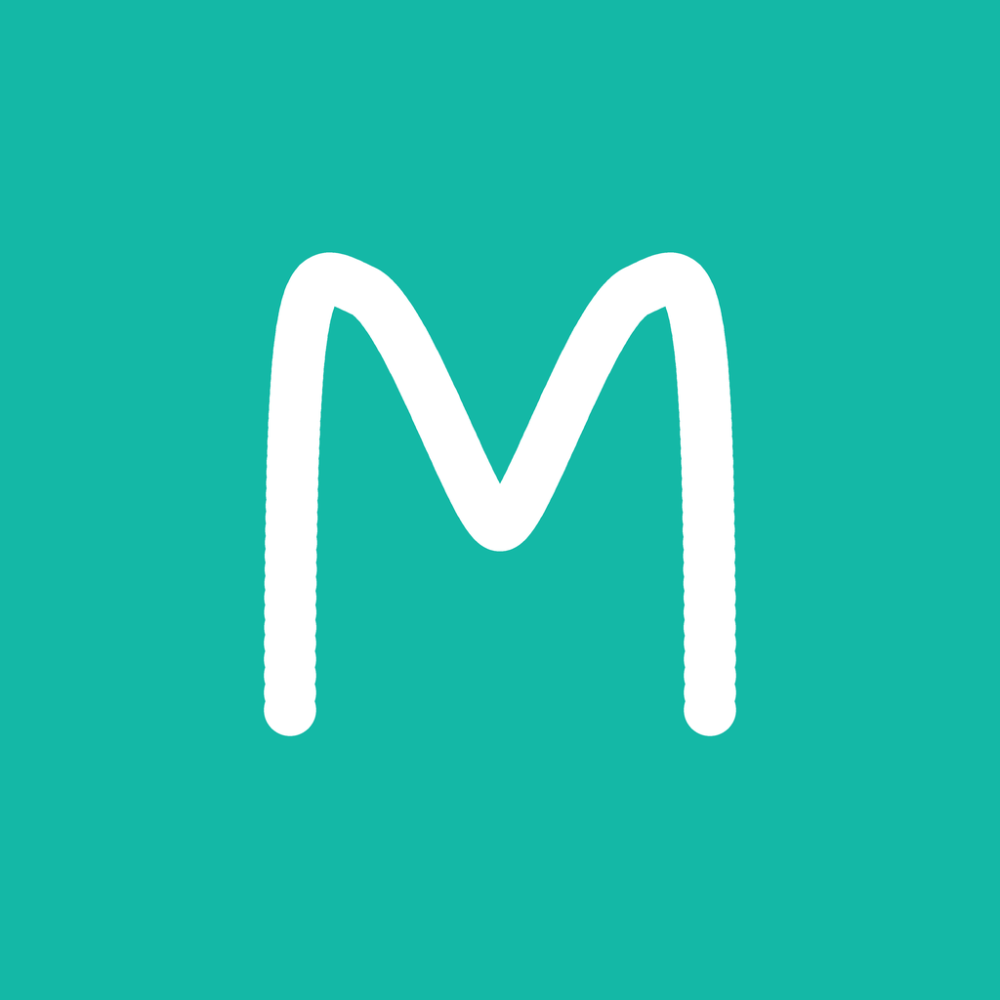

<p align="center">
  
</p>

<h1 align="center">MacroTracker</h1>

<p align="center">
  <em>Track macros. Scan barcodes. Stay on target.</em>
</p>

<p align="center">
  
  
  
  
</p>

---

A free, local-first macro tracking app built with SwiftUI. No subscriptions. No accounts. Your data stays on your device.

### Features

| | |
|---|---|
| **Macro Dashboard** | Daily calorie, protein, carb & fat tracking with visual progress rings |
| **Barcode Scanner** | Scan any barcode — nutrition data pulled from OpenFoodFacts |
| **Custom Foods** | Create and save your own foods with full macro info |
| **Recipes** | Build recipes from ingredients, auto-calculates per-serving macros |
| **Serving Editor** | Change serving size and units on any scanned food |
| **Protein Calculator** | Set protein goals based on body weight × g/lb |
| **iMessage Sharing** | Send your daily summary to a contact with one tap |
| **Dark Mode** | Full adaptive dark mode support |

### Stack

```
SwiftUI · SwiftData · VisionKit · MessageUI · OpenFoodFacts API
```

### Setup

```bash
brew install xcodegen    # if not installed
xcodegen generate
open MacroTracker.xcodeproj
```

Build & run on any iOS 17+ simulator or device.

---

<sub>Built with Claude Code.</sub>
